<p align="center">
  
</p>

# 🚀 YCScraper: Y-Combinator Founder Social Link Scraper (LinkedIn & X.com)

<p align="center">
  <a href="https://github.com/ishandutta2007/Awesome-Awesome-Awesome"></a>
  <a href="https://discord.gg/jc4xtF58Ve"></a>
  <a href="https://github.com/ishandutta2007/YCScraper/stargazers"></a>
  <a href="https://github.com/ishandutta2007/YCScraper/network/members"></a>
  <a href="https://github.com/ishandutta2007/YCScraper/issues"></a>
  <a href="https://github.com/ishandutta2007/YCScraper/blob/main/LICENSE"></a>
  <a href="https://github.com/ishandutta2007"></a>
</p>

## 🚀 Overview
YCScraper is a powerful and efficient Python-based tool designed to automatically scrape and collect public LinkedIn and X.com (formerly Twitter) profiles of founders from Y-Combinator (YC)-backed companies. Whether you're a recruiter, investor, researcher, or simply looking to expand your network within the startup ecosystem, YCScraper provides an invaluable resource for data extraction and analysis.

This project leverages browser automation to navigate YC's extensive company directory and meticulously extract founder information, presenting it in a clean, structured format for easy use.

## ✨ Features
*   **Comprehensive Data Collection:** Gathers LinkedIn and X.com URLs for Y-Combinator founders.
*   **Automated Browsing:** Utilizes Selenium for robust web scraping, handling dynamic content.
*   **Configurable:** Easily adaptable for different YC batches or specific company lists.
*   **Structured Output:** Generates CSV files with founder names, company affiliations, and their respective social media links.
*   **Developer-Friendly:** Written in Python, making it easy to understand, modify, and extend.

## 🛠️ Technologies Used
*   **Python 3.x:** The core programming language.
*   **Selenium:** For browser automation and web interaction.
*   **WebDriver Manager:** To automatically manage and download appropriate browser drivers (e.g., ChromeDriver).

## ⚡ Getting Started

### 📋 Prerequisites
Before you begin, ensure you have the following installed:
*   🐍 Python 3.x
*   📦 `pip` (Python package installer)

### 📥 Installation

1.  **Clone the repository:** 📂
    ```bash
    git clone https://github.com/ishandutta2007/YCScraper.git
    cd YCScraper
    ```

2.  **Create a virtual environment (recommended):** 🌐
    ```bash
    python -m venv venv
    .\venv\Scripts\activate   # On Windows
    source venv/bin/activate # On macOS/Linux
    ```

3.  **Install the required Python packages:** 📦
    ```bash
    pip install -r requirements.txt
    ```

### 💻 Usage

#### 1. Fetch Entire YC Batch Directory (API Data - One CSV per Batch) 📡
To quickly download all YC company batches (Winter, Spring, Summer, Fall) using YC's search API into individual CSV files under the `data/` folder:

```bash
python fetch_yc_batches.py
```

⚙️ Options:
- `--season`: Filter by specific season (e.g. `python fetch_yc_batches.py --season Winter`)
- `--batch`: Download a single batch (e.g. `python fetch_yc_batches.py --batch "Summer 2024"`)
- `--output-dir`: Custom output folder (default: `data/`)

#### 2. Scrape Founder Social Links (Selenium) 🤖
To run the Selenium scraper for extracting founder social media profiles:

```bash
python YCScraper.py
```

### 📊 Output Example
The generated CSV file will typically have columns similar to this:

| Company Name        | Founder Name     | LinkedIn Profile                               | X.com Profile                           |
| :------------------ | :--------------- | :--------------------------------------------- | :-------------------------------------- |
| Example Startup Inc. | Jane Doe         | `https://www.linkedin.com/in/janedoe`          | `https://x.com/janedoe`                 |
| Innovative Solutions | John Smith       | `https://www.linkedin.com/in/johnsmith`        | `https://x.com/johnsmith_tech`          |
| ...                 | ...              | ...                                            | ...                                     |

## 🤝 Contributing
Contributions are welcome! If you have suggestions for improvements, bug fixes, or new features, please feel free to:
1.  🍴 Fork the repository.
2.  🌿 Create a new branch (`git checkout -b feature/your-feature-name`).
3.  📝 Make your changes.
4.  💾 Commit your changes (`git commit -m 'Add some feature'`).
5.  🚀 Push to the branch (`git push origin feature/your-feature-name`).
6.  📬 Open a Pull Request.

## 📄 License
This project is licensed under the MIT License - see the `LICENSE` file for details.
*(Note: A `LICENSE` file should be added to the repository if not already present.)*


### ✨ Star History

[](https://www.star-history.com/#ishandutta2007/YCScraper&type=date&legend=top-left)
